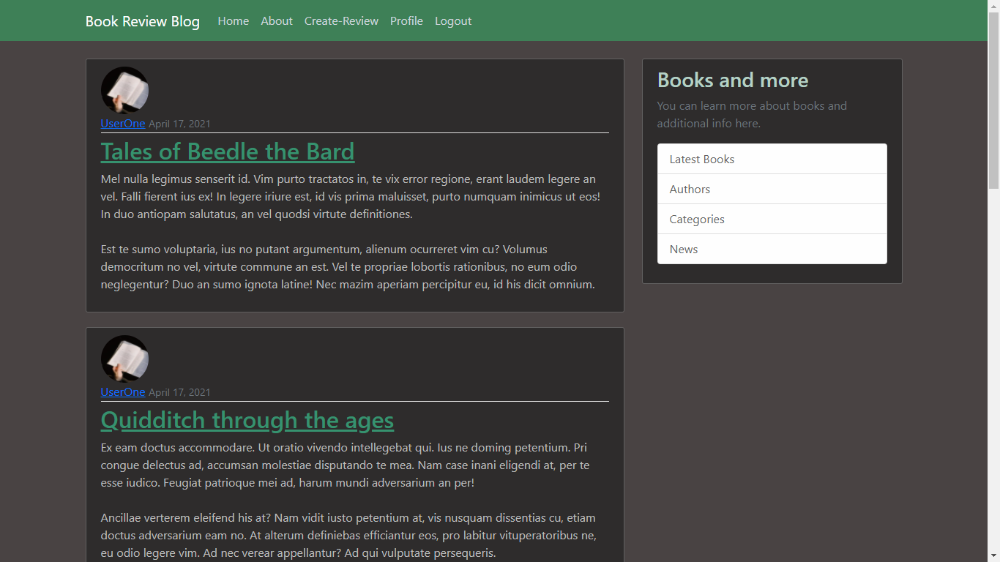
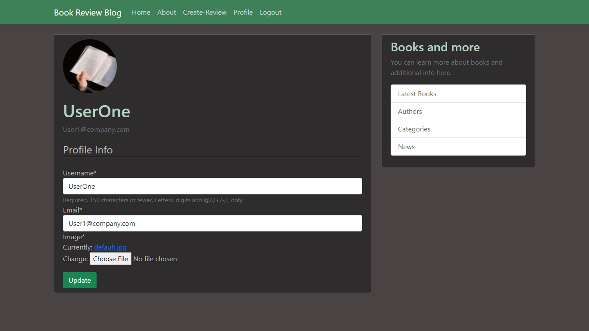
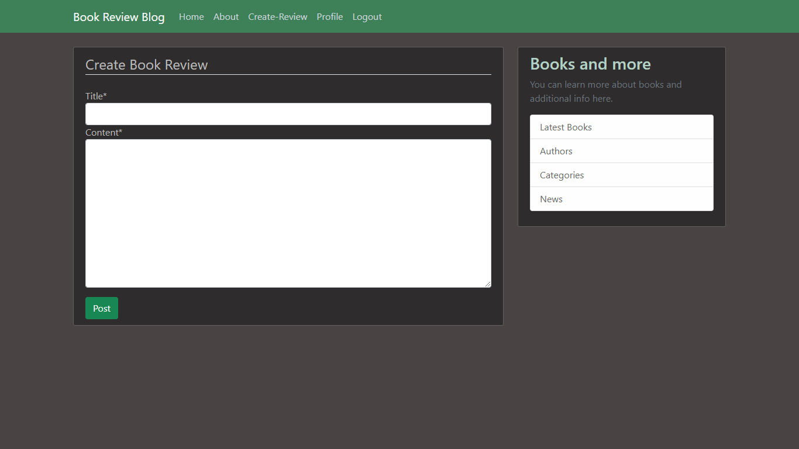
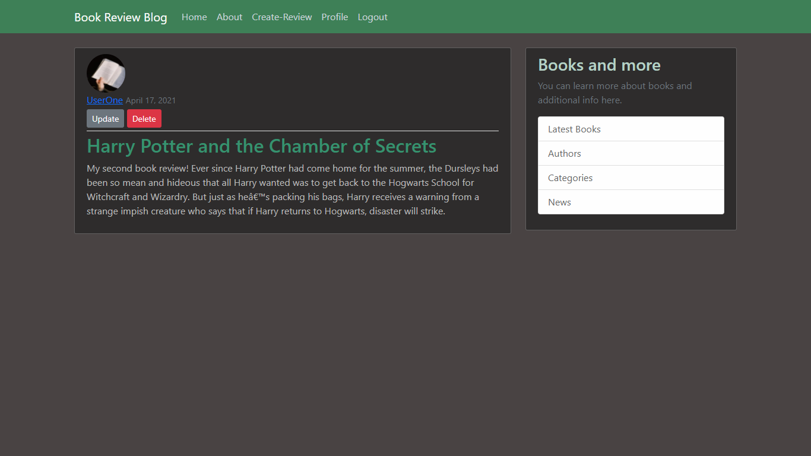

# Django-Book-Review-Blog

A full featured blogging app where users can create profile, write book reviews, update and delete them.

## Screenshots

### Home Page


### Profile Page


### Create-New-Review Page


### Post-Edit Page


## Features

* A fast, interactive interface for book lovers.
* Create profile, update and delete them.
* Group Book reviews from same user.
* Interactive E-mail support.
* Create, update and delete the blog posts. 

# Prerequisite

```bash
python == 3.5 or up
```

# Getting started

To get started, run the following in a virtual environment:

``` bash
pip install -r requirements.txt
python manage.py makemigrations
python manage.py migrate
python manage.py createsuperuser
python manage.py runserver
```
## Authors

* **Bishnu** - *Initial work* - [Bishnu Subedi](https://github.com/bishnu-subedi)


## License

This project is licensed under the MIT License - see the [LICENSE](LICENSE) file for details
